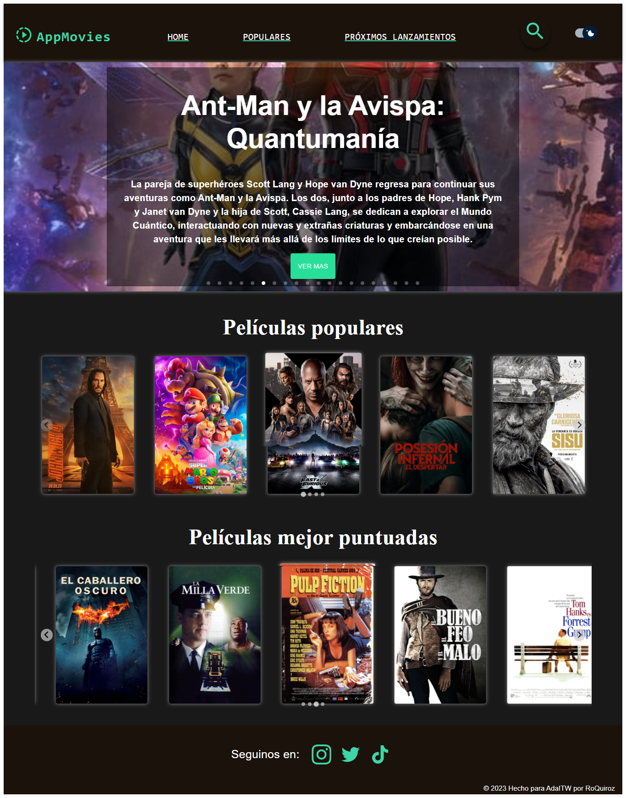

# Movies App 📽🤗
## Mi buscador de películas. *Por Rocio Quiroz*
> *Proyecto final React para Ada ITW*   
---

### [¡Hecha un vistazo a mi proyecto!](https://vrocioquiroz.github.io/js-tp-generador-de-contrase-as/) 🎞   

Proyecto realizado en React que aúna los conocimientos del módulo final del boot camp de Desarrollador Front End, integrando también conocimientos adquiridos a lo largo de la cursada como Javascript, HTML%, CSS entre otros...

Para esta web de pelis, utilicé React, Javascript, Material UI para estilos y algunos componentes, como tambien otras librerias para componentes específicos como por ejemplo el carrusel ubicado en la Home page. La base de datos utilizada es de la API gratuita de themoviedb.org.

🎬 Mi proyecto cuenta con una Home page en la cual se visualiza un carrusel con las películas en tendencia de la semana. El mismo da acceso a ver el detalle de dicha película.   

🎬 También se visualiza un splide de películas con películas populares y otro con las mejores puntuadas.      

🎬 Un imput de búsqueda libre que renderiza las películas coincidentes a medida que el usuario escribe.   

🎬 El header da acceso al home, a las películas populares y a los próximos lanzamientos.   

🎬 Tiene un modo claro y oscuro para preferencia visual del usuario.   

🎬 Al clickear en una película da acceso al detalle de la misma, con datos del título, año de lanzamiento, reseña y póster. También se puede acceder al trailer de la misma!! 

---
## Espero les guste mi proyecto!! ❤💻   

 

